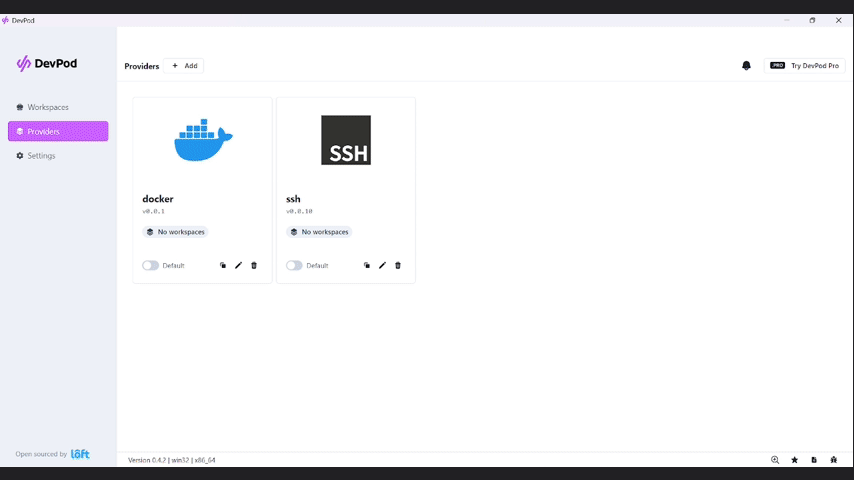

# YandexCloud Provider for DevPod


## Example



## Getting started

The provider is available for auto-installation using

```sh
devpod provider add github.com/ArhostCode/devpod-provider-yandexcloud
devpod provider use github.com/ArhostCode/devpod-provider-yandexcloud
```

or the DevPod UI:
1. Use `ArhostCode/devpod-provider-yandexcloud` to setup environment

Follow the on-screen instructions to complete the setup.

Needed variables will be:

- **YC_API_KEY** - Yandex Cloud Oauth token. To obtain follow
  instructions - https://cloud.yandex.ru/ru/docs/iam/concepts/authorization/oauth-token

### Creating your first devpod env with yandex cloud

After the initial setup, just use:

```sh
devpod up .
```

You'll need to wait for the machine and environment setup.

### Customize the VM Instance

This provides has the seguent options

| NAME              | REQUIRED | DESCRIPTION                                                                           | DEFAULT       |
|-------------------|----------|---------------------------------------------------------------------------------------|---------------|
| YC_ZONE           | true     | The yandex cloud zone id                                                              | ru-central1-a |
| YC_DISK_SIZE_GB   | true     | The disk size in GB.                                                                  | 30 GB         |
| YC_MEMORY_SIZE_GB | true     | The RAM size in GB.                                                                   | 8 GB          |
| YC_FOLDER_ID      | true     | [Folder ID](https://cloud.yandex.ru/ru/docs/resource-manager/operations/cloud/get-id) |               |
| YC_CORES_COUNT    | true     | Yandex Cloud platform cores count                                                     | 2             |
| YC_PLATFORM_ID    | true     | Yandex Cloud platform id                                                              | standard-v1   |

Options can either be set in `env` or using for example:

```sh
devpod provider set-options -o YC_ZONE=ru-central1-a
```

